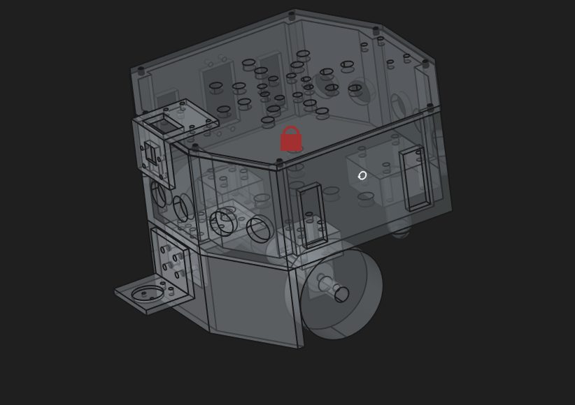
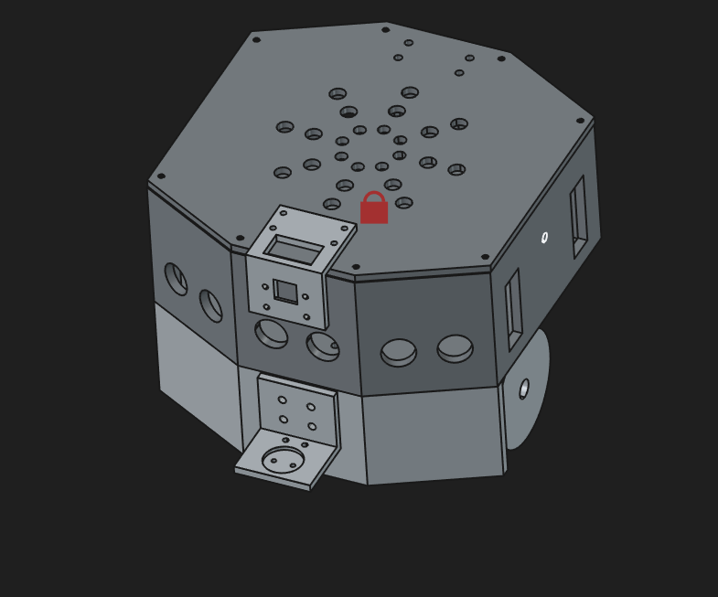
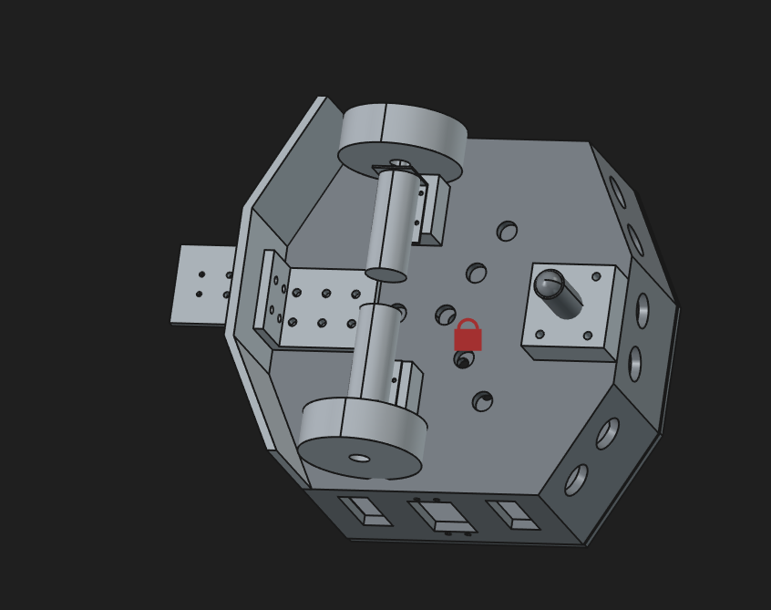
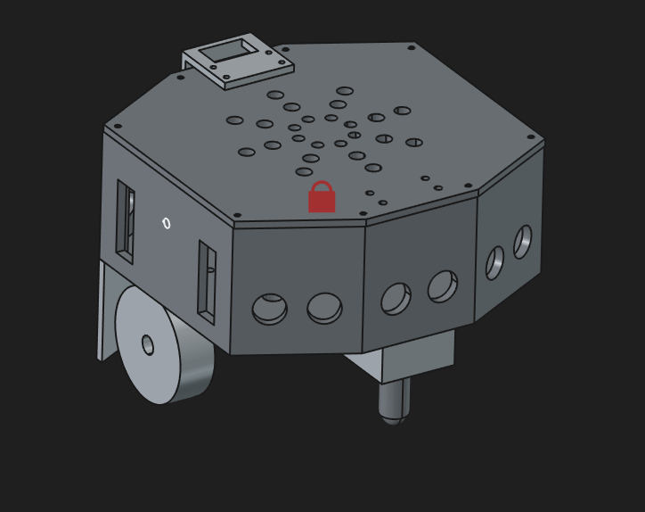

# Building Robot for Unibots 2026 Competition


## Hardware Specifications, Design & Assembly
- Dimension 200 x 200 mm
- Camera for detecting balls and April Tags
- Gripper mechanism for picking balls.
- Bill of material and connection details are available on [hardware.md](./hardware.md) page.


## Software Requirements
- Raspberry Pi OS (Bookworm)
- Arduino IDE 
- OpenCV
- Ultralytics for installing YOLO Object detector
- Picamera2 Library for accessing Picamera
- Pupil Apriltag detection library

## Camera Calibration
Cameras are calibrated to estimate depth values directly from images. The codes and instructions are available inside `./camera_calibration` folder. 

## Testing
Individual sensor/actuator test codes are available inside `./robot_2wd_12V/tests/` folder.


## Final Code
Final code for the complete robot is available inside `./robot_2wd_12V/integration/` folder. The final code can be executed as follows:

Open a terminal and execute the following instructions:
```
source ~/.virtualenvs/yolov8env/bin/activate
(yolov8env) cd ~/unibots2026/robot_2wd_12V/integration
(yolov8env) python ./motion_plan.py
```
and follow the instructions on the console.

## Images

### Physical Robot 


### CAD Designs
| View 1 | View 2|
|------- | ----|
| | |
| | |
 


### Demo Videos
* [Complete operation sequence](https://www.youtube.com/watch?v=WwZn5CcYXa4)

* [Line-following](https://www.youtube.com/shorts/x4pc6ktMP7s)

* [Initial system integration test](https://www.youtube.com/shorts/Uw7y9ATVvvU)


